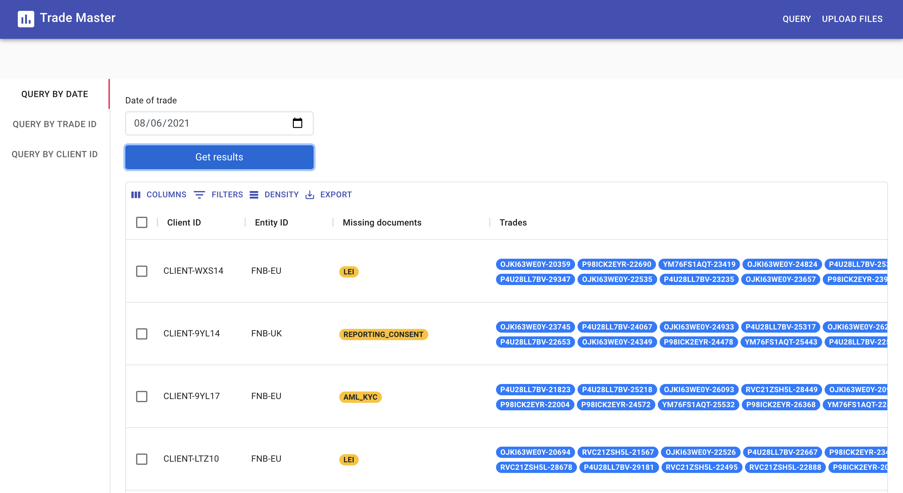

# Trade Master (Global Markets application)
This web application lets the user query trading data as well as upload trading data files to the server.

This project was developed with [React js](https://github.com/facebook/create-react-app) and [Django](https://www.djangoproject.com/). It is assumed that the unix/macOS machine this project runs on already has python3 and node installed.

<p align="center">

</p>

## Installation and setup
#### Django

To run the backend server you need to complete the following steps -

Install python dependencies (navigate to the project_backend directory and install all python dependencies)
```sh
cd project_backend/
pip3 install -r requirements.txt
```

Make the database migrations in the same directory (this created and registers database tables with the server)
```sh
python3 manage.py makemigrations
python3 manage.py migrate
```

Run the server on port 8001 (this opens the server on [http://127.0.0.1:8001/](http://127.0.0.1:8001/)). You may get a warning screen as the project is running on a DEBUG mode (you can just ignore this and continue).
```sh
python3 manage.py runserver 8001  
```
This starts the server and you can use the admin panel at [http://127.0.0.1:8001/admin/](http://127.0.0.1:8001/admin/). This requires you to sign in by creating a SuperUser.
```sh
python3 manage.py createsuperuser
```
Alternatively, you can use credentials- {username: arya002, password: Login@1234}

#### React

To run the frontend React server you need to complete the following steps -

Install node dependencies (navigate to the frontend directory and install all node dependencies)
```sh
cd project-frontend/
npm install
```

This starts the frontend server at [http://localhost:3000/](http://localhost:3000/). The port may differ if you have another application already open at port 3000.
```sh
npm start
```

Remember to upload the 2 json files (GTT and Trade data) provided to the website before making queries, or the results would come back empty.

## About the project

This project is made for the GMOT department of the Bank of America and enables the user to query data as well as upload json files to be stored in the database.

Features :

- Upload GTT data json file which gets parsed and stored in the DataBase
- Upload Trade data json file which gets parsed and stored in the DataBase
- Query records by Data
- Query records by Trade ID
- Query records by Client ID

## Parser
The file parser has been implemented in a way to handle duplicate entries to avoid redundancy and any possible clashes. The json schema is also checked to make sure the files follow the right format before being parsed.

## Tech

Trade Master uses a number of open source projects to work properly:

- [ReactJS] - javaScript framework for froent-end design
- [Django] - python based back-end framework
- [npm] - package manager for JavaScript
- [Twitter Bootstrap] - great UI boilerplate for modern web apps
- [Material UI] - another great UI builder
- [Axios] - promise based HTTP client for the browser and node.js

[//]: # (These are reference links used in the body of this note and get stripped out when the markdown processor does its job. There is no need to format nicely because it shouldn't be seen. Thanks SO - http://stackoverflow.com/questions/4823468/store-comments-in-markdown-syntax)

   [ReactJS]: <https://github.com/facebook/create-react-app>
   [Django]: <https://www.djangoproject.com/>
   [npm]: <https://www.npmjs.com/>
   [Twitter Bootstrap]: <https://getbootstrap.com/>
   [Material UI]: <https://material-ui.com/>
   [Axios]: <https://github.com/axios/axios>

   [PlDb]: <https://github.com/joemccann/dillinger/tree/master/plugins/dropbox/README.md>
   [PlGh]: <https://github.com/joemccann/dillinger/tree/master/plugins/github/README.md>
   [PlGd]: <https://github.com/joemccann/dillinger/tree/master/plugins/googledrive/README.md>
   [PlOd]: <https://github.com/joemccann/dillinger/tree/master/plugins/onedrive/README.md>
   [PlMe]: <https://github.com/joemccann/dillinger/tree/master/plugins/medium/README.md>
   [PlGa]: <https://github.com/RahulHP/dillinger/blob/master/plugins/googleanalytics/README.md>
